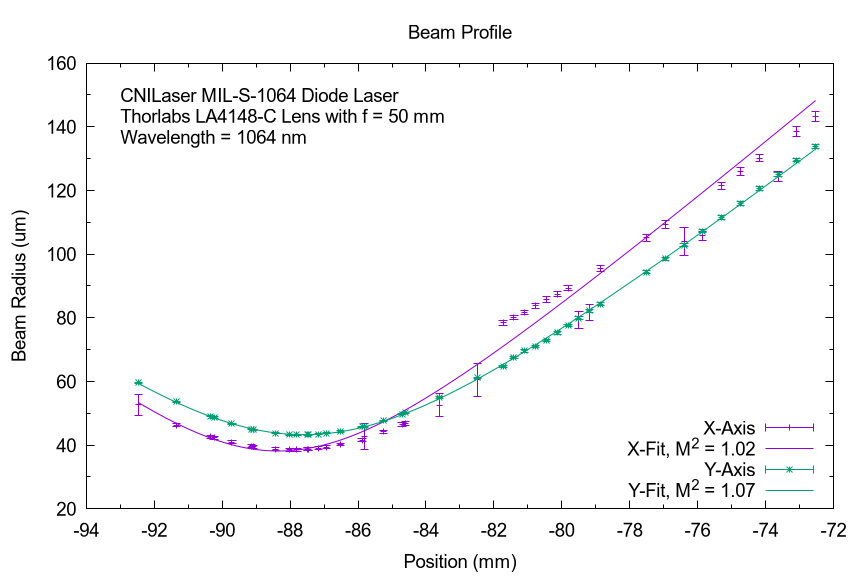

# M-Squared Automation
Automated measurement of [M²](https://en.wikipedia.org/wiki/M_squared), also known as the beam propagation ratio or beam quality factor, using the WinCamD / Nanoscan beam profilers. WinCamD and NanoScan code may be used independently.

**Table of Content**
* [Important Note](#important-note)
* [Supported Models](#supported-models)
* [Version Information](#version-information)
* [Installation](#installation)
    + [Quick Start](#quick-start)
    + [Python Modules](#python-modules)
    + [NanoScan](#nanoscan)
    + [WinCamD](#wincamd)
* [Independent Modules](#independent-modules)
    + [Beam-Profilers](#beam-profilers)
        - [NanoScan](#nanoscan-1)
        - [WinCamD](#wincamd-1)
    + [Stage](#stage)
* [Extending this code](#extending-this-code)
    + [Logging](#logging)
* [Usage](#usage)
* [How it works](#how-it-works)
    + [Measuring Beam-Width Data](#measuring-beam-width-data)
        - [Preparation](#preparation)
        - [Measuring the caustic](#measuring-the-caustic)
    + [Fitting the Data](#fitting-the-data)
* [Demo](#demo)
* [Troubleshooting](#troubleshooting)
    + [WinCamD is not giving my any data/no DataReady events are fired](#wincamd-is-not-giving-my-any-datano-dataready-events-are-fired)
    + [NanoScan reports "All devices in use"](#nanoscan-reports-all-devices-in-use)
    + [NanoScan is only giving me -0.1 as the beamwidth](#nanoscan-is-only-giving-me--01-as-the-beamwidth)
    + [NanoScan signal too weak/strong, or scan head rotation not suitable](#nanoscan-signal-too-weakstrong-or-scan-head-rotation-not-suitable)
    + [NanoScan is taking very long to initialize](#nanoscan-is-taking-very-long-to-initialize)
* [Code Linting in VS Code](#code-linting-in-vs-code)
* [References](#references)

<small><i><a href='http://ecotrust-canada.github.io/markdown-toc/'>Table of contents generated with markdown-toc</a></i></small>

## Important Note
This repository also contains code to interact with the WinCamD and Nanoscan Beam Profiler. These functions may be used independent of the M² Measurement code.

See [below](#independent-modules) for more information on how to use it.

## Supported Models
- The WinCamD Camera used is the [DataRay WinCamD-IR-BB](https://dataray.com/collections/beam-profiling-cameras/products/wincamd-ir-bb-broadband-2-to-16-%C2%B5m-mwir-fir-beam-profiler). 

- The NanoScan Camera used is the [Ophir NanoScan 2s Pyro/9/5](https://www.ophiropt.com/laser--measurement/beam-profilers/products/Scanning-Slit-Beam-Profiling-with-NanoScan/NanoScan-2s-Pyro-9-5). You will need the PRO version instead of the STD Version. The activation code is device-specific and written into the EEPROM of the Scanhead. The NanoScan vendor software then checks the activation status of the Scanhead before marshalling the function calls to it. 

- The stage controller used for this project is the [SIGMAKOKI/OptoSigma Controller `GSC-01`](https://jp.optosigma.com/html/en/page_pdf/GSC-01.pdf) with the accompanying stage `SGSP26-200`.

Due to software compability issues, device-interfacing code for the beam profilers in this repository can only run on Windows. 

## Version Information
For Python packages used, refer to [`conda-environment.yml`](./conda-environment.yml). 

The DataRay Software versions used for the development of this code are as follows:
- 32-bit: [iDataRay80D63](https://dataray-web.s3.amazonaws.com/sw/iDataRay80D63.zip)
- 64-bit: [iDataRay80D62_x64](https://dataray-web.s3.amazonaws.com/sw/iDataRay80D62_x64.zip)

The NanoScan Software version is: `v2.9.1.28`.

## Installation
### Quick Start
1. Install the necessary vendor software for [NanoScan](#nanoscan) and [WinCamD](#wincamd).
2. Clone the repository
    - Using Git Bash: `git clone https://github.com/sunjerry019/nanosquared/`
    - Git GUI
        - Right click on parent folder > Git GUI Here
        - Clone a repository > Source Location: https://github.com/sunjerry019/nanosquared/
3. To prepare the Python environment, you may choose to use [Anaconda](https://www.anaconda.com/):
```bat
conda env create -f conda-environment.yml
conda activate nanosquared
```
4. Thereafter, install the `nanosquared` package by navigating to the repository and doing:
```bat
pip install .
```
5. Verify that you have installed it properly by doing:
```python
import nanosquared
```
Steps 4 and 5 makes it easier to use the package but is not essential.

### Software Updates
Should there be new versions of the nanosquared software, you can simply run [`update-and-install.bat`](./update-and-install.bat), which will get the newest update from Github and then install it as a local package (not strictly required for use). [_The environment nanosquared needs to be set up with Anaconda_]

Alternatively, the updates may be obtained using the following method:
- Run [`update.bat`](./update.bat)
- Using Git Bash in the folder: `git pull origin master`
- Git GUI
    1. Right click on parent folder > Git GUI Here
    2. Remote > Fetch from > origin
    3. Merge > Local Merge > Tracking Branch > origin/master

Then you may run 
```
conda activate nanosquared
pip install .
```
to install the latest version of the software as a local python package.

### Python Modules
Should you need to directly debug the NanoScan interfacing C# code, prepare a 32-bit environment:
```bat
conda env create -f src\nanosquared\cameras\archive\nanoscan\nanoscan_32.yml
conda activate nanoscan-32bit
```
This might be necessary as not all function calls exposed by the NanoScan ActiveX Endpoint has been implemented into `NanoScanLibrary.dll`. Consult the [C# directory](./src/nanosquared/cameras/csharp) for more information.

### NanoScan
To use the `NanoScan` Python Interface, you first need to install the `NanoScan` software. A [copy](./installers) of which lives in this repository for archival purposes.

Due to some security policy, loading a DLL from a network location may be disabled on certain computers. In this case, copy `NanoScanLibrary.dll` and `NS2_Interop.dll` to `C:\nanosquared_include\` and it should load fine. The scripts are written in such a way as to fall back to that location (This behaviour may change in the future).

*More to be added*

### WinCamD
To use the `WinCamD` Python Interface, you first need to the install [DataRay](https://dataray.com/blogs/software/downloads) software. 

Please install the version that corresponds to your Python installation (i.e. 64-bit DataRay for 64-bit Python). As DataRay is regularly putting out updates for their devices, we have decided not to include the installer in this repository. Please visit their website for more information, or [see above](#version-information) for the links to the versions used during the development of this code.  

*More to be added*

## Independent Modules
For every one of these modules described below, the `LoggerMixIn` class has been used. While technically not necessary, it has been included to aid debugging.

Include [`helpers.py`](./src/nanosquared/common/helpers.py) for the `LoggerMixIn` class. See [below](#logging) for more information.

### Beam-Profilers
You may use the `NanoScan` and `WinCamD` modules independent of the rest of the code in the repository to manage and use the respective beam-profilers (here loosely referred to as cameras). For that, follow the instructions detailed in the above sections ([NanoScan](#NanoScan) and [WinCamD](#WinCamD)) to install the necessary support software. Then follow the instructions under [Usage](#Usage) to import the necessary packages:
```python
# For NanoScan
from nanosquared.cameras.nanoscan import NanoScan
cam = NanoScan(devMode = False)

# For WinCamD
from nanosquared.cameras.wincamd import WinCamD
cam = WinCamD(devMode = False)
```
These 2 modules may be packaged into seperate packages should someone find the time to do it. It would be a meaningful endeavour in providing Python support for these 2 devices. 

Both of these modules inherit the `Camera` class, which guarantees the existence of the following:
```python
x, y, both = cam.AXES.X, cam.AXES.Y, cam.AXES.BOTH  # Enum for the different axes
cam.getAxis_avg_D4Sigma(axis = x, numsamples = 20)  # Obtains an average D4Sigma diameter
cam.wait_stable()                                   # Function returns when beam-profiler is stable
cam.log()
```
See the specific source code for more detailed documentation of the functions.

If you do not wish to download the entire repository to interface with these beam profilers, a list of necessary files may be found under [cameras/README](./src/nanosquared/cameras/README.md).

#### NanoScan
In addition to the above functions, `NanoScan` also provides the `cam.rotationFrequency` property to set the rotation speed of the scan head. 

Most other functions exposed by the ActiveX Endpoint may be accessed using:
```python
cam.NS.<func>
```
where `<func>` is the function you want to call. Refer to [the C# source code](./src/nanosquared/cameras/csharp/NanoScanLibrary/NanoScan.cs) for a list of implemented function calls. The documentation for each of the ActiveX function can be (normally) found under:
```
C:\Program Files (x86)\Photon\NanoScan v2\Documentation\50318-001 NanoScan v2 Automation Developer Guide.pdf
```
where usually the `NsAs` part of the function name has been removed in the C# function.

See [csharp/README.md](./src/nanosquared/cameras/csharp/README.md) for more information on why such an implementation was used. 

#### WinCamD
In addition to the above functions, `WinCamD` also provides:
```python
cam.startDevice(); cam.stopDevice()
cam.setClipMode(mode = CLIP_MODES.CLIP_LEVEL_METHOD, clip = 50) # Sets the clipping mode for the width data
cam.getAxis_D4Sigma(axis = cam.AXES.X)   # Gets a single reading of the D4Sigma beam width
cam.getWinCamData(axis = cam.AXES.X)     # Gets an array of pixel data
cam.getCameraIndex()                     # Gets the index of the camera, esp if more than one camera is attached
```

### Stage
The `GSC01` stage controller module from OptoSigma may also be used independently. If you only want to interact with the stage, then you only need the files from [src/nanosquared/stage](./src/nanosquared/stage). Currently, only the accompanying stage `SGSP26-200` has been implemented. To use another stage, make a copy of that class and modify the parameters accordingly. Theoretically, any stage that works with the `GSC01` controller should work with the code. See the [manual](https://jp.optosigma.com/html/en/page_pdf/GSC-01.pdf) for more information.

To use the `SGSP26-200` stage:
```python
from nanosquared.stage.controller import GSC01

with GSC01(devMode = False) as control:
    control.homeStage()

    # move 10 um
    pulses = control.um_to_pulse(um = 10, asint = True)
    # we use asint because GSC01 can only use integer pulses
    control.setSpeed(minSpeed = 500, maxSpeed = 6000)
    control.rmove(delta = pulses)

    # move to specific position
    control.move(pos = 500)
```
See [src/nanosquared/stage/controller.py](./src/nanosquared/stage/controller.py) for more available functions.

If a stage other than the `SGSP26-200` is to be used, then implement a class as such:
```python
import nanosquared.stage._stage as Stg

class NewStageName(Stg.GSC01_Stage):    
    def __init__(self, *args, **kwargs):
        super().__init__(*args, **kwargs) 

        self.travel     = 200 # mm  # REQUIRED: Obtain from stage
        self.pulseRange = 100557    # REQUIRED: Obtain from stage
        self.recalculateUmPerPulse()

    def resetStage(self):
        upper = (self.pulseRange - 1) / 2
        lower = - upper

        return self.setLimits(lower = lower, upper = upper)
```
and then pass it into the controller:
```python
st = GSC01(stage = NewStageName(), devMode = False)
```
See [src/nanosquared/stage/_stage.py](./src/nanosquared/stage/_stage.py) for more information.

## Extending this code
The code responsible for communicating with each component are separated into different modules, which can be imported into a combination script. As OOP concepts have always been the core to the design of this software, any new stage/beam profiler can easily be integrated into the project by extending the base classes. 

Refer to [fitting](./src/nanosquared/fitting) for documentation on the fitting module, and how you might can extend it to suit your purposes. 

### Logging
All logging is provided by the `LoggerMixIn` class under [`src/nanosquared/common/helpers.py`](./src/nanosquared/common/helpers.py). All component classes inherit `LoggerMixIn`, which provides the method `self.log()`. This allows easy control of the log level and the way logging is handled in the entire project. 

If you are adding modules to the codebase, it is recommended to inherit the `LoggerMixIn` class.

## Usage
**To start the quick-and-dirty CLI Application, simply double click on `launch_m2.bat`.**

**The environment `nanosquared` needs to be set up with Anaconda.**

If you are using a `pip`-installed version, simply do:
```python
import nanosquared
```
If you are planning to use the python files directly, add the following to the top of your script:
```python
import os,sys
src_dir = os.path.join("full\path\to\repo","src")
sys.path.insert(0, src_dir)
```
You can import and use the modules, for example:
```python
from nanosquared.cameras.nanoscan import NanoScan
n = NanoScan(devMode = False)
print(n.getAxis_avg_D4Sigma(axis = n.AXES.X, numsamples = 100))
```
Example on how to measure the M² of a beam:
```python
from nanosquared.measurement.measure import Measurement
from nanosquared.cameras.nanoscan import NanoScan
from nanosquared.stage.controller import GSC01

from nanosquared.fitting.fitter import MsqFitter

cfg = { "port" : "COM13" } # Check with "Device Manager" for port number

with NanoScan(devMode = False) as n:
    with GSC01(devMode = False, devConfig = cfg) as s:
        with Measurement(devMode = False, camera = n, controller = s) as M:
            meta = {
                "Wavelength": "2300 nm",
                "Lens": "f = 250mm CaF2 lens"
            }
            M.take_measurements(precision = 10, metadata = meta) 
            # incl. auto find beam waist and rayleigh length
            # Measurement data will be saved under 
            #   ``repo/data/M2/<datetime>_<random string>.dat``
            # together with the metadata

            # To save to a specific file, use: 
            #   `M.take_measurements(precision = 10, metadata = meta, writeToFile = "path/to/file")`
            # or run
            #   `M.write_to_file("path/to/file", metadata = meta)

            # Explicit options
            res = M.fit_data(axis = M.camera.AXES.X, wavelength = 2300, \
                mode = MsqFitter.M2_MODE, useODR = False, xerror = None)
            print(f"X-Axis")
            print(f"Fit Result:\t{res}")
            print(f"M-squared:\t{M.fitter.m_squared}")
            fig, ax = M.fitter.getPlotOfFit()
            fig.show()

            res = M.fit_data(axis = M.camera.AXES.Y, wavelength = 2300) # Use defaults (same as above)
            print(f"Y-Axis")
            print(f"Fit Result:\t{res}")
            print(f"M-squared:\t{M.fitter.m_squared}")
            fig, ax = M.fitter.getPlotOfFit()
            fig.show()
```
If the measurement has already been taken and only a fit is required, then you can run:
```python
from nanosquared.measurement.measure import Measurement

with Measurement(devMode = True) as M:
    M.read_from_file("path/to/file")

    res = M.fit_data(axis = M.camera.AXES.X, wavelength = 2300)
    print(f"X-Axis")
    print(f"Fit Result:\t{res}")
    print(f"M-squared:\t{M.fitter.m_squared}")
    fig, ax = M.fitter.getPlotOfFit()
    fig.show()

    res = M.fit_data(axis = M.camera.AXES.Y, wavelength = 2300)
    print(f"Y-Axis")
    print(f"Fit Result:\t{res}")
    print(f"M-squared:\t{M.fitter.m_squared}")
    fig, ax = M.fitter.getPlotOfFit()
    fig.show()
```

*More to be added, or even separate README.*

## How it works
### Measuring Beam-Width Data
The measurement of the M² data is carried out by the [Measurement](./src/nanosquared/measurement/measure.py) module.

#### Preparation
If no center is given, the code uses the [ternary search algorithm](https://en.wikipedia.org/wiki/Ternary_search) will be used on each axis to find the center. 

From the center, 10 equidistant points will be symmetrically chosen around the center within the [Rayleigh Length](https://en.wikipedia.org/wiki/Rayleigh_length) and 10 between 2 and 3 times the Rayleigh Length. In total, 21 points will be taken (10 + 10 + 1), including the center.

If no Rayleigh Length is given, the code uses the [ITP Method](https://en.wikipedia.org/wiki/ITP_method) to find an approximation for it. This works by shifting all beam width data downwards by √2*`w0`, where `w0` is measured the beam width as measured at the center found by the ternary search algorithm. The default parameters used for the ITP method are as follows:
```
kappa_1 = 0                     
kappa_2 = golden ratio = 1.618
n_0     = 0 
```
`kappa_1 = 0` is not technically allowed, but experimentally it helps the algorithm to converge faster in certain cases. 

**NOTE**: z_R searching working in both directions. However, the direction of beam propagation in which the beam is coming in from the dial side of the stage is preferred over the other and will be searched first. 

This way all parameters of the beam may be determined experimentally.
#### Measuring the caustic
The code will measure 10 points with +/- z_R around the center, and then based on the situation, try to measure:
- [symmetrical case] 5 points from +2z_R to +3z_R and 5 points from -3z_R to -2z_R
- [asymmetrical case] 10 points from +2z_R to +3z_R
- [inverted asymmetrical case] 10 points from -3z_R to -2z_R 

in that order.

If using all 3 methods does not allow all points to fit within the travel range of the stage, then the function ends and refuses to continue. The setup is therefore not suitable for this stage. Change the setup so that the full measurement process may fit within the travel range of the stage. 

### Fitting the Data
The `Fitter` module under [fitting](./src/nanosquared/fitting) is used to fit the data obtained. 
```
Fitter ┬─> ODRFitter (scipy.odr):                optimizes x and y-error
       ├─> OCFFitter (scipy.optimize.curve_fit): optimizes y-error
       │
    ┌──┴───> MsqODRFitter / MsqOCFFitter: Provides all functionalities
    │                                     and fitting using the selected 
    │                                     fitting method
    │
MsqFitter: Provides functionalities common to all fitting methods
```
There are 2 different fitters available (see above). See [fitting](./src/nanosquared/fitting) for more details on the fitting modes available to obtain M² (M²λ, M² and ISO modes). 

The default fitting method is `scipy.optimize.curve_fit`. 

By default, we do not use the fit equation described in ISO 11146-1:2021 Section 9 due its large errors. Instead, we use the *M² Mode*, which fits the obtained caustic to the guassian beam equation:
<p align="center"></p>
This obtains the M² parameter as one of the fit parameters. 

## Demo
<p align="center"></p>

## Troubleshooting
### WinCamD is not giving my any data/no DataReady events are fired
This could be because there are some limitation on the number of devices that can be plugged into one set of USB ports on the computer. Try plugging the stage and WinCamD to separate sides of the computer/laptop.

### NanoScan reports "All devices in use"
Go into the Task Manager (Ctrl + Shift + Esc), then click on the *"Processes"* Tab, find *NanoScanII.exe* and end the process.This is likely caused by an improper shutdown, in which the NanoScan Program was not closed properly.

Ensure that no instances of *NanoScanII.exe* are running before restarting the program. 

### NanoScan is only giving me -0.1 as the beamwidth
*Note: This could also manifest as nothing happening after requesting a beam width reading. This is because the software is waiting for sensible data as part of the `wait_stable` subroutine.*

There could be many reasons this could be happening. Troubleshoot by opening the NanoScan software provided by Ophir Optics to determine if the NanoScan is even providing any form of data.

If there is no data despite starting data acquisition, then perhaps you need to plug NanoScan into another USB Port.

Another reason could be that the NS software did not close properly. Try running `nanoscan.py` directly and then:
```python
n.NS.ShutdownNS()
```
Then try to restart your original application that makes use of `NanoScan`.

### NanoScan signal too weak/strong, or scan head rotation not suitable
In this case, you can try to use an attenuator, or adjust the scan head rotation frequency:
```python
n = NanoScan()
n.rotationFrequency = 2.5
```
You can get the allowed rotation frequencies through `n.allowedRots` or `n.NS.GetHeadScanRates()`. For the NanoScan 2s Pyro/9/5 used in the development of this script, the allowed rotations (in Hz) are:
```
[1.25, 2.5, 5.0, 10.0, 20.0]
```

### NanoScan is taking very long to initialize
Sometimes this problem could be caused by the system taking very long to read from a network drive. In this case, try to connect the laptop to a Ethernet/LAN connection and try again.

## Code Linting in VS Code
Refer to https://stackoverflow.com/a/54488818 for taming PyLint. In particular, you can do:
```json
"python.linting.pylintArgs": [
		"--max-line-length=80",
		"--disable=all",
		"--enable=F,E,unreachable,duplicate-key,unnecessary-semicolon,global-variable-not-assigned,unused-variable,binary-op-exception,bad-format-string,anomalous-backslash-in-string,bad-open-mode",
		"--disable=W0142,W0403,W0613,W0232,R0903,R0913,C0103,R0914,C0304,F0401,W0402,E1101,W0614,C0111,C0301"
	]	
```

## References
[Beam Profilers](./src/nanosquared/cameras/references.md)
